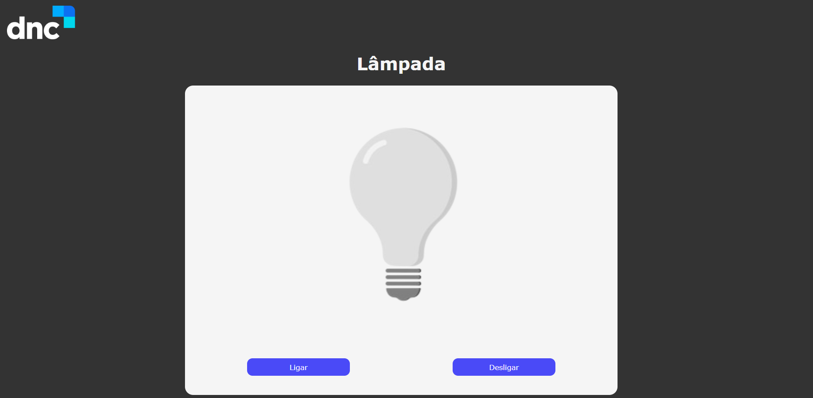

	

	<h1>Site da lâmpada DNC</h1>

### O que é? 🤔
Site desenvolvido para testar funções e eventos DOM.

### Quais tecnologias foram usadas? 💻
- HTML5
- CSS3
- Javascript

### Está online? 📡
SIM! Basta [clicar aqui](https://lampada-dncc.netlify.app/) para visualizar o site que está hospedado nos servidores da Netlify.

by Murillo Couto 
[GitHub](https://github.com/MurilloCouto)
